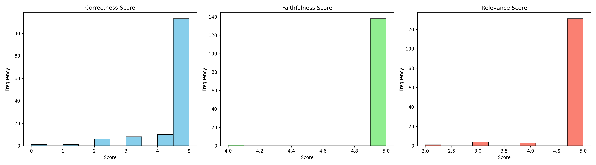
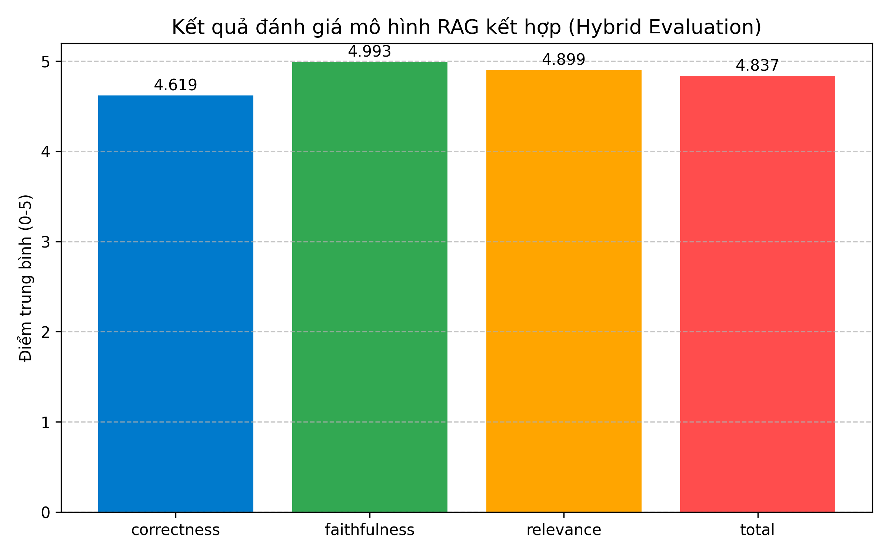

# ***INTELLIGENT CHATBOT FOR FOUNDATIONAL HISTORY OF PARTY OF VIET NAM AND PHILOSOPHICAL EDUCATION***
Chatbot **Retrieval-Augmented Generation (RAG)** được thiết kế để trả lời các câu hỏi học thuật liên quan đến các môn đại cương – hiện tại hỗ trợ:
- **Lịch Sử Đảng** (hệ không chuyên)
- **Triết Học Mác – Lênin** (hệ không chuyên)

Hệ thống bao gồm 2 thành phần chính:

- **Retrieval**: sử dụng 2 phương pháp:
    - `Parent Document Retrieval`
    - `Hybrid Search (Dense + Sparse)`
  với cơ sở dữ liệu vector lưu trữ trên **Pinecone**.

- **Generation**: sử dụng mô hình **Gemini 2.5** (`flash` hoặc `pro`) để sinh câu trả lời có tham chiếu ngữ cảnh.

# Kết quả đánh giá mô hình (Model Evaluate - Hybrid Search)
## **Tổng quan**
Đánh giá mô hình RAG sử dụng chiến lược Hybrid Search, tập trung vào ba chỉ số chất lượng chính:

- Correctness (Độ chính xác)

- Faithfulness (Tính trung thực)

- Relevance (Mức độ liên quan)

## **Kết quả chi tiết**

### 🔹 Biểu đồ phân phối điểm số (Histogram)


### 🔹 Biểu đồ tổng hợp điểm tổng thể


# Tính năng chính

- **Retrieval**:
  - Hybrid Search: kết hợp dense + sparse retrieval
  - Parent Chunk Retrieval: mở rộng ngữ cảnh bằng đoạn cha
  - Dùng Pinecone để lưu trữ vector database

- **Generation**:
  - Prompting linh hoạt kết hợp dữ liệu retrieved
  - Dùng Gemini 2.5 (chọn giữa `flash` hoặc `pro`) để sinh câu trả lời

- **Dữ liệu**: đã index sẵn tài liệu môn Triết và Lịch Sử Đảng (nội dung giáo trình chính quy)

---
# 📁 Cấu trúc dự án
```text
RAG_GeneralSubject/
├── data/                         # Chứa các dữ liệu của nhóm môn Đại Cương
│ ├── LichSuDang/                 # Chứa dữ liệu của môn Lịch Sử Đảng
│ ├── TrietHoc/                   # Chứa dữ liệu của môn Triết Học
│ ├── TuTuongHoChiMinh/           # Chứa dữ liệu của môn Tư Tưởng Hồ Chí Minh
│ └── upsert.ipynb                # File Ju notebook, được dùng để upsert các Data dạng Json lên Pinecone
│
├── eval/                         # Thư mục để eval mô hình
│ ├── eval_data.                  # Dữ liệu đánh giá
│ └── hybrid_evaluate.ipynb       # Đánh giá mô hình với phương thứ Hybrid Search
│
├── retriever/                    # Phần retriever của RAG
│ ├── cache_data.py               # Chạy các thành phần cần thiết của Model, dự án
│ ├── hybrid_search.py            # Thực hiện Hybrid Search
│ └── parent_retrieval            # Chạy Parenting Document Search
│
├── utils/                        # Chạy các hàm cần thiết cho quá trình DEV
│
├── agent.py                      # Thực hiện phân loại câu hỏi và tạo câu trả lời
│
├── requirements.txt              # Các thư viện cần thiết để chạy dự án
│
├── streamlit_interface.py        # File chính của dự án, chạy giao diện + gọi agent để thực hiện chức năng
│
└── README.md                     # File giới thiệu dự án
```

# ⚙️ Cài đặt
## Cài đặt các thành phần cần thiết
```
git clone -b QThinh___ https://github.com/KuroBerry/RAG_GeneralSubject.git
cd RAG_GeneralSubject
python -m venv venv && source venv/bin/activate
pip install -r requirements.txt
```

## Thêm API key
- Tạo một file .env và thêm các API theo các biến sau: 
```
GEMINI_API_KEY=""
PINECONE_API_KEY=""
HOST_DENSE=""
HOST_SPARSE=""
```

## Upsert dữ liệu có sẵn lên Pinecone của bạn
Sau khi đã cài đặt xong file .env, hãy chạy file Jupyter Note sau để upsert data lên Pinecone Databse của bạn

[Chạy file `upsert.ipynb`](./data/upsert.ipynb)

## Chạy app streamlit
- Sau khi thực hiện xong các bước trên, hãy chạy file interface sẽ đưa bạn đến giao diện của web DEMO chatbot.
```
streamlit run 'path to streamlit_interface.py'
```
